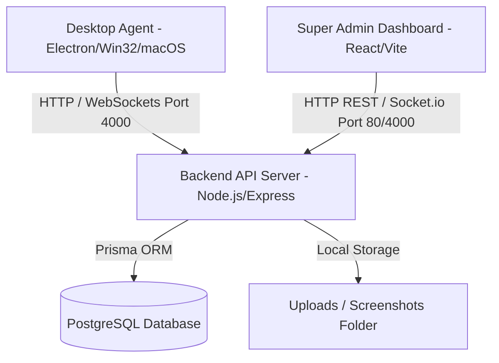

# 📘 Improx Monitoring System - Master Knowledge Transfer (KT) & Onboarding Guide

> **Document Purpose:** Complete, step-by-step Knowledge Transfer (KT) guide for any new software engineer, DevOps admin, or team lead taking over the maintenance, deployment, and management of the **Improx Monitoring System**.

---

## 📑 Table of Contents
1. [System Overview & Architecture](#-system-overview--architecture)
2. [Credentials & Access Checklist](#-credentials--access-checklist)
3. [Setting Up a New Developer Machine](#-setting-up-a-new-developer-machine)
4. [Managing the Hostinger Production VPS](#-managing-the-hostinger-production-vps)
5. [Building & Releasing Employee Installers (.exe & .dmg)](#-building--releasing-employee-installers-exe--dmg)
6. [Troubleshooting & Common Tasks](#-troubleshooting--common-tasks)

---

## 🏗️ System Overview & Architecture

The Improx Monitoring System is an enterprise-grade employee productivity tracking platform comprising 3 core components:



1. **Desktop Agent (`/desktop-agent`)**:
   - Built with Electron 31 + TypeScript + Native Win32/macOS tracking hooks.
   - Runs silently in the background, capturing screenshots every 10 minutes, counting keypresses & mouse clicks, active application names, and idle time.
2. **Backend API Server (`/backend`)**:
   - Built with Node.js + Express + TypeScript + Socket.io + Prisma ORM + PostgreSQL.
   - Hosted 24/7 on **Hostinger VPS** (`200.141.2.53:4000`). Handles authentication, screenshot uploads, activity scoring, and auto-update feeds.
3. **Super Admin Web Dashboard (`/frontend`)**:
   - Built with React 18 + Vite + Tailwind CSS + Lucide Icons + Recharts.
   - Served via Nginx reverse proxy at `http://200.141.2.53`.

---

## 🔑 Credentials & Access Checklist

Before starting, ensure you have received access to the following 4 portals/credentials:

### 1. Source Code Repository (GitHub)
- **URL:** [https://github.com/bankarom/monitoring-system.git](https://github.com/bankarom/monitoring-system.git)
- **Required Role:** `Admin` or `Owner`.
- *Action for outgoing developer:* Go to GitHub Repo Settings → Collaborators / Access and transfer repository ownership or invite the new developer email as Admin.

### 2. Production Hostinger VPS Server
- **Server IP:** `200.141.2.53`
- **SSH Terminal Connection:** `ssh root@200.141.2.53`
- **Application Directory on Server:** `/root/improx-monitor`
- **Hostinger Account Control Panel:** [https://hpanel.hostinger.com](https://hpanel.hostinger.com)
- *If root password is forgotten:* Log in to Hostinger hPanel → VPS → Select `200.141.2.53` → Click **Reset Root Password**.

### 3. Super Admin Web Dashboard Access
- **Dashboard URL:** `http://200.141.2.53`
- **Default Super Admin Email:** `admin@improx.com`
- **Default Password:** `Admin@123456` (or `#admin0089000#`)

### 4. Database Access (PostgreSQL on VPS)
- **Host:** `localhost:5432` (inside VPS)
- **Database Name:** `improx_monitor`
- **User:** `postgres`
- **Password:** `postgres`

---

## 💻 Setting Up a New Developer Machine

Follow these exact steps to run the complete project on a new laptop/computer:

### Step 1: Install Required Tools on Your PC
- Install **Node.js v20 or v22** ([nodejs.org](https://nodejs.org/))
- Install **Git** ([git-scm.com](https://git-scm.com/))
- Install **VS Code** ([code.visualstudio.com](https://code.visualstudio.com/))

### Step 2: Clone the Repository
Open Terminal or PowerShell and run:
```bash
git clone https://github.com/bankarom/monitoring-system.git
cd monitoring-system
```

### Step 3: Install Dependencies for All Projects
```bash
# 1. Install Backend dependencies
cd backend
npm install

# 2. Install Frontend dependencies
cd ../frontend
npm install

# 3. Install Desktop Agent dependencies
cd ../desktop-agent
npm install
```

### Step 4: Running the Code Locally
To run and test components locally on your developer machine:

* **To run Backend API locally:**
  ```bash
  cd backend
  npm run dev
  ```
  *(Backend runs on `http://localhost:4000`)*

* **To run Admin Web Dashboard locally:**
  ```bash
  cd frontend
  npm run dev
  ```
  *(Frontend runs on `http://localhost:5000`)*

* **To run Desktop Agent locally in dev mode:**
  ```bash
  cd desktop-agent
  npm run dev
  ```

---

## 🌐 Managing the Hostinger Production VPS

The production server runs 24/7 in the cloud independently of any developer laptop.

### 1. How to SSH into the Server
Open your terminal (PowerShell / macOS Terminal) and type:
```bash
ssh root@200.141.2.53
```
Enter your root password when prompted.

### 2. How to Deploy Code Updates to the Live Server
Whenever code changes are made locally and pushed to GitHub (`git push origin main`), update the live server in 1 line:

```bash
cd /root/improx-monitor && git pull origin main && cd backend && npm run build && pm2 restart all && cd ../frontend && npm run build
```

### 3. Essential Server Management Commands
Once connected to VPS via SSH:

* **View live running backend processes:**
  ```bash
  pm2 status
  ```
* **View real-time backend logs (for debugging):**
  ```bash
  pm2 logs improx-backend
  ```
* **Restart all server processes:**
  ```bash
  pm2 restart all
  ```
* **Check Nginx web proxy status:**
  ```bash
  systemctl status nginx
  ```
* **Wipe all old test data & screenshots (Fresh Start):**
  ```bash
  cd /root/improx-monitor/backend && node dist/scripts/wipeAllData.js
  ```

---

## 📦 Building & Releasing Employee Installers (.exe & .dmg)

### 1. Windows Installer (`.exe`)
When you modify the Desktop Agent code and want to create a new `.exe` setup file for Windows employees:

1. Open terminal in `desktop-agent`:
   ```bash
   cd desktop-agent
   npm run dist
   ```
2. The output executable is created at:
   `desktop-agent/release/Improx Monitoring System Setup 1.0.0.exe`
3. Copy this new installer to `backend/downloads/` and `backend/updates/` so employees can download it directly from `http://200.141.2.53:4000/updates/Improx Monitoring System Setup 1.0.0.exe`.

### 2. macOS Installer (`.dmg`)
Building macOS `.dmg` installers requires a macOS environment. This project uses **GitHub Actions** to compile macOS `.dmg` installers automatically:

1. Any time code is pushed to GitHub `main` branch, GitHub Actions automatically builds the macOS `.dmg` file.
2. **How to download the compiled `.dmg`:**
   - Go to GitHub repo: [https://github.com/bankarom/monitoring-system](https://github.com/bankarom/monitoring-system)
   - Click **Actions** tab → Click **Build macOS Desktop Agent (DMG Only)**.
   - Click the latest workflow run → Scroll down to **Artifacts** → Click **`Improx-Agent-macOS-DMG`**.
3. **If Chrome says "Dangerous download blocked":**
   - Press `Ctrl + J` in Chrome → Click **Keep dangerous file** / **Keep anyway**. (This warning appears only because the binary is not signed with an Apple developer certificate).
   - Unzip the downloaded file to get `Improx Monitoring System Setup 1.0.0.dmg`.

---

## ❓ Troubleshooting & Common Tasks

### Q1: An employee says their agent is not connecting to the server.
- **Check 1:** Ensure employee's computer is connected to the internet.
- **Check 2:** Check if backend API is up on VPS by opening `http://200.141.2.53:4000/api/health` in your browser. If it doesn't load, SSH into VPS and run `pm2 restart all`.

### Q2: How do employees get automatic updates?
- The desktop agent silently checks `http://200.141.2.53:4000/updates/latest.yml` every hour. When a new release is pushed to VPS `/backend/updates`, agents update automatically in the background without employee intervention.

### Q3: How do I change the Super Admin password?
- Log into Super Admin Dashboard at `http://200.141.2.53` → Go to **Settings** → Change Password, or run `node dist/scripts/resetAdminPassword.js` on VPS backend.

---

### 🏁 Knowledge Transfer Sign-Off
With this guide, GitHub repository access, and Hostinger VPS root credentials, the new team/developer has 100% control to manage, build, deploy, and maintain the system!
